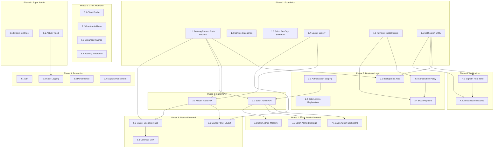

# BookVisit Implementation Roadmap
Generated: 2026-03-21
Based on: Full codebase analysis + Functional specification cross-reference

## Executive Summary

BookVisit is approximately **40-45% complete** relative to the full specification. The core CRUD infrastructure is solid: 13 entities with EF Core, 13 API controllers (~45 endpoints), full JWT + OAuth authentication, on-the-fly availability engine, and a React frontend with 29 pages covering client booking flow, subdomain routing, and basic admin panels. The backend follows Clean Architecture with well-separated Domain/Application/Infrastructure/API layers, and the frontend uses React 18 + TypeScript + Tailwind with proper state management via contexts.

The **biggest gaps** are: (1) Payment system — no payment processing, no BOG integration, no Payments table; (2) Notification infrastructure — no persisted notifications, no push, no in-app notification system; (3) Incomplete booking state machine — missing Rejected, NoShow, Expired statuses and background job automation; (4) No i18n — all strings hardcoded in English, spec requires Georgian (ka) + Russian (ru); (5) Missing role-specific panels — master self-service panel and salon admin dashboard are partially built but lack dedicated self-scoped endpoints; (6) No service categories — flat service list without categorization.

The **critical path** is: Expand booking statuses + state machine → Add payment infrastructure → Build notification system → Complete role-specific panels (master, salon admin) → Add i18n → Polish for production.

---

## Codebase State

### Backend

- **Project structure:** Clean Architecture — 4 projects (`Domain`, `Application`, `Infrastructure`, `API`) + 1 test project, .NET 8, EF Core 8.0.11, PostgreSQL
- **Solution file:** `BeautySalonBooking.sln`
- **Entities (13):**
  - `Salon` — `src/BeautySalonBooking.Domain/Entities/Salon.cs`
  - `Master` — `src/BeautySalonBooking.Domain/Entities/Master.cs`
  - `SalonMaster` — `src/BeautySalonBooking.Domain/Entities/SalonMaster.cs`
  - `Service` — `src/BeautySalonBooking.Domain/Entities/Service.cs`
  - `MasterService` — `src/BeautySalonBooking.Domain/Entities/MasterService.cs`
  - `Booking` — `src/BeautySalonBooking.Domain/Entities/Booking.cs`
  - `BookingService` — `src/BeautySalonBooking.Domain/Entities/BookingService.cs`
  - `MasterRating` — `src/BeautySalonBooking.Domain/Entities/MasterRating.cs`
  - `TimeSlot` — `src/BeautySalonBooking.Domain/Entities/TimeSlot.cs` (legacy, mostly unused)
  - `MasterWeeklySlot` — `src/BeautySalonBooking.Domain/Entities/MasterWeeklySlot.cs`
  - `MasterDateOverride` — `src/BeautySalonBooking.Domain/Entities/MasterDateOverride.cs`
  - `MasterDateOverrideSlot` — `src/BeautySalonBooking.Domain/Entities/MasterDateOverrideSlot.cs`
  - `MasterTimeOff` — `src/BeautySalonBooking.Domain/Entities/MasterTimeOff.cs`
  - `AppUser` — `src/BeautySalonBooking.Infrastructure/Entities/AppUser.cs` (ASP.NET Identity)
  - `RefreshToken` — `src/BeautySalonBooking.Infrastructure/Entities/RefreshToken.cs`
- **Controllers (13):**
  - `AuthController` — `src/BeautySalonBooking.API/Controllers/AuthController.cs` (~17 endpoints)
  - `AdminUsersController` — `src/BeautySalonBooking.API/Controllers/AdminUsersController.cs`
  - `SalonsController` — `src/BeautySalonBooking.API/Controllers/SalonsController.cs`
  - `MastersController` — `src/BeautySalonBooking.API/Controllers/MastersController.cs`
  - `SalonMastersController` — `src/BeautySalonBooking.API/Controllers/SalonMastersController.cs`
  - `MasterServicesController` — `src/BeautySalonBooking.API/Controllers/MasterServicesController.cs`
  - `ServicesController` — `src/BeautySalonBooking.API/Controllers/ServicesController.cs`
  - `BookingsController` (+ SalonBookingsController + MasterBookingsController) — `src/BeautySalonBooking.API/Controllers/BookingsController.cs`
  - `RatingsController` — `src/BeautySalonBooking.API/Controllers/RatingsController.cs`
  - `TimeSlotsController` — `src/BeautySalonBooking.API/Controllers/TimeSlotsController.cs`
  - `AvailabilityController` — `src/BeautySalonBooking.API/Controllers/AvailabilityController.cs`
  - `MediaController` — `src/BeautySalonBooking.API/Controllers/MediaController.cs`
  - `DevSeedController` — `src/BeautySalonBooking.API/Controllers/DevSeedController.cs`
- **Services (10 application + 3 support):**
  - Application: AuthService, BookingService, AvailabilityService, SalonService, MasterService, SalonMasterService, MasterServiceManager, CatalogService, RatingService, TimeSlotService
  - Support: TokenService, NotificationService (email only), MinioStorageService
  - Domain: AvailabilityEngine (slot computation)
- **Enums:** AppRole (SuperAdmin, SalonAdmin, Master, Client), BookingStatus (Pending, Confirmed, Completed, CancelledByClient, CancelledByMaster), TimeSlotStatus (Available, Booked, Blocked)
- **Migrations:** 8 migrations, all applied
- **Tests:** 151 passing (84 unit + 67 integration)
- **Missing infrastructure:**
  - No Payments table/entity/service
  - No Notifications table (emails sent but not persisted)
  - No AuditLog table
  - No ServiceCategory entity
  - No background jobs / hosted services
  - No CQRS / MediatR (direct service calls)
  - No salon-scoping authorization middleware
  - No dedicated master self-service or salon admin controllers
  - Booking state machine incomplete (missing Rejected, NoShow, Expired statuses)

### Frontend

- **Project structure:** React 18 + TypeScript + Vite 6 + Tailwind v4 at `frontend/`
- **Pages/routes (29 pages):**
  - **Auth (7):** LoginPage, RegisterPage, MasterRegisterPage, ForgotPasswordPage, ResetPasswordPage, ForceChangePasswordPage, GooglePopupRedirectPage
  - **Client (9):** HomePage, SalonDetailsPage, MasterProfilePage, BookingFlowPage, BookingConfirmationPage, ViewBookingPage, MyBookingsPage, SalonLandingPage (subdomain), Root, NotFoundPage
  - **Admin (12):** AdminLayout, DashboardPage, SalonsPage, SalonFormPage, MastersPage, MasterFormPage, ServicesPage, BookingsAdminPage, BookingDetailAdminPage, UsersPage, UserDetailPage, AvailabilityPage
- **Components (18):** Header, BottomNav, ImageWithFallback, DevRoleSwitcher, ServiceCard, TimeSlotGrid, BookingSummary, MasterCard, ReviewCard, SalonCard, Button, Badge, FormField, InfoRow, Loader, EmptyState, DragDropUpload, Modal
- **Contexts (4):** AuthContext, BookingContext, ThemeContext, SalonSubdomainContext
- **API modules (10):** client, auth, salons, masters, services, bookings, ratings, timeslots, availability, media
- **Missing infrastructure:**
  - No i18n setup (all strings English)
  - No notification bell / push notifications
  - No payment form / BOG integration
  - No master self-service panel (profile editing, portfolio gallery, personal bookings view)
  - No salon admin dashboard with metrics
  - No service categories UI
  - No calendar view for bookings
  - No reCAPTCHA integration for guest bookings
  - No client profile page

---

## Cross-Reference Results

| # | Checklist Item | Status | Details |
|---|---------------|--------|---------|
| **Database** | | | |
| D-1 | SalonAdmins junction table | ❌ | Not a separate table. Tracked via `AppUser.SalonId` + `AppUser.Role == SalonAdmin` in `Infrastructure/Entities/AppUser.cs` |
| D-2 | Payments table | ❌ | No payment entity, table, or migration exists |
| D-3 | SalonSchedule (per-day hours) | ❌ | Salon has `WorkingHoursStart`/`WorkingHoursEnd`/`WorkingDays` on the `Salon` entity itself (not per-day granularity). Per-day schedule exists only at `SalonMaster` + `MasterWeeklySlot` level |
| D-4 | MasterGallery | ❌ | No gallery entity. `MasterService` has optional `Photo` field. Master has single `Photo` field |
| D-5 | SalonMedia | ❌ | `Photos` and `Videos` stored as `List<string>` on `Salon` entity (`Domain/Entities/Salon.cs`) — not a separate table |
| D-6 | Notifications table | ❌ | No persisted notifications. `NotificationService` (`Infrastructure/Services/NotificationService.cs`) sends emails only |
| D-7 | AuditLog | ❌ | No audit log entity or table |
| D-8 | ServiceCategories | ❌ | Flat `Service` entity with no category grouping |
| D-9 | Bookings.UserId nullable (guest bookings) | ✅ | `UserId` is `Guid?` in `Domain/Entities/Booking.cs`, migration `20260310221330_AddBookingUserId` |
| D-10 | SalonMasterId FK on Bookings | ❌ | Booking uses separate `SalonId` + `MasterId` FKs (not a single `SalonMasterId`) in `Domain/Entities/Booking.cs` |
| D-11 | BookingStatus includes Rejected, NoShow, Expired | ❌ | Only 5 values: `Pending`, `Confirmed`, `Completed`, `CancelledByClient`, `CancelledByMaster` in `Domain/Enums/BookingStatus.cs` |
| D-12 | Salon has PaymentModel, cancellation policy fields | ❌ | `Salon` entity has no payment or cancellation-related fields |
| D-13 | DeletedAt (soft delete timestamp) on entities | ❌ | Uses boolean flags: `Salon.IsActive`, `Master.IsDeleted`, `SalonMaster.IsActive`, `MasterService.IsActive` — no `DeletedAt` timestamps |
| **Backend Endpoints** | | | |
| E-1 | Salon admin self-registration | ❌ | Only master self-registration exists (`POST /api/auth/master/register`). No salon admin self-registration endpoint |
| E-2 | Booking reject and no-show endpoints | ❌ | Only confirm/complete/cancel exist in `BookingsController.cs`. No reject or no-show actions |
| E-3 | Dedicated MasterPanelController (self-scoped) | ❌ | Masters use general `MastersController` + `AvailabilityController`. No self-scoped panel controller |
| E-4 | Dedicated SalonAdminController (salon-scoped) | ❌ | Salon admins use general `SalonsController`. No salon-scoped controller with dashboard/metrics |
| E-5 | Payment endpoints (initiate, callback, capture, refund) | ❌ | No payment code exists |
| E-6 | Notification endpoints (list, read, unread-count) | ❌ | No notification REST endpoints |
| E-7 | Booking state machine / transition validation | 🟠 | Basic transitions in `BookingService.cs` (Pending→Confirmed, Confirmed→Completed, Pending/Confirmed→Cancelled). No formal state machine class, no validation of invalid transitions beyond status checks |
| E-8 | Background jobs (expire, remind, cleanup) | ❌ | No `IHostedService`, `BackgroundService`, or job scheduler |
| E-9 | Salon-scoping middleware for salon admin | ❌ | No middleware filtering data by salon. Role-based `[Authorize]` only |
| **Frontend** | | | |
| F-1 | Subdomain detection | ✅ | `frontend/src/lib/subdomain.ts` + `SalonSubdomainContext.tsx` + `SubdomainApp.tsx` |
| F-2 | Dynamic theming from salon config | ✅ | `ThemeContext.tsx` applies salon's `primaryColor`, `accentColor`, `borderRadius` as CSS variables |
| F-3 | Booking flow (service → date → slot → form → confirm) | ✅ | `BookingFlowPage.tsx` — 3-step flow with `BookingContext` |
| F-4 | Guest booking form | ✅ | `BookingFlowPage.tsx` allows unauthenticated booking with name/phone/email fields |
| F-5 | Master panel with 3 pages (profile, schedule, bookings) | 🟠 | Only `AvailabilityPage.tsx` (schedule management). No dedicated master profile edit page or master-specific bookings view |
| F-6 | Salon admin panel with dashboard | 🟠 | `DashboardPage.tsx` exists but is superadmin-only. Salon admin can edit own salon via `SalonFormPage.tsx` but has no metrics dashboard |
| F-7 | Super admin panel | ✅ | DashboardPage, SalonsPage, MastersPage, ServicesPage, BookingsAdminPage, UsersPage — all accessible to superadmin |
| F-8 | i18n setup (ka, ru) | ❌ | No i18n library, no translation files, all strings hardcoded in English |
| F-9 | Notification bell / push notification components | ❌ | No notification UI components |
| F-10 | Payment form / BOG integration | ❌ | No payment UI |

---

## Spec vs Code Mismatches

This section lists EVERY discrepancy found between the specification document and the actual codebase.
The codebase is the source of truth for the current state. The spec is the source of truth for the desired state.

### Approach Conflicts (code and spec both exist but disagree)

| # | Area | Code has (file path) | Spec wants | Analysis | Recommendation |
|---|------|---------------------|-----------|----------|----------------|
| AC-1 | Booking FK structure | Separate `SalonId` + `MasterId` FKs in `Domain/Entities/Booking.cs` | Single `SalonMasterId` FK referencing junction table | **Code approach**: simpler queries, direct FK navigation, but doesn't enforce salon-master link at DB level. **Spec approach**: enforces that booking is for a valid salon-master pair via FK constraint, but requires join to get salon/master. | **Keep code approach.** Application-level validation already checks SalonMaster link exists in `BookingService.CreateAsync()`. Adding SalonMasterId FK would require migration + breaking changes for marginal DB-level safety. Optionally add a computed column or check constraint later. |
| AC-2 | Booking cancellation statuses | Two statuses: `CancelledByClient` (3) + `CancelledByMaster` (4) in `Domain/Enums/BookingStatus.cs` | Single `Cancelled` status with cancellation metadata | **Code approach**: distinguishes cancellation source at enum level, easy filtering. **Spec approach**: single status with side tracked in separate field. | **Keep code approach.** Having distinct statuses is more explicit, easier to query, and already integrated across BE+FE. The `CancellationReason` field on Booking provides additional context. |
| AC-3 | Salon schedule model | `Salon` entity has `WorkingHoursStart`/`WorkingHoursEnd` (single time range) + `WorkingDays` (list) in `Domain/Entities/Salon.cs` | Per-day schedule grid (different hours per day, e.g., Mon 09-18, Sat 09-14) | **Code approach**: simpler, one schedule for all working days. **Spec approach**: more flexible, real-world salons often have different weekend hours. | **Migrate to spec approach.** Real salons need per-day hours. Add `SalonDaySchedule` entity or JSON column. Low-risk migration since current data can be expanded (same hours for all working days). |
| AC-4 | Soft delete pattern | Boolean flags (`IsActive`, `IsDeleted`) — no timestamps in `Domain/Entities/Salon.cs`, `Master.cs` | `DeletedAt` nullable DateTime (soft delete timestamp) | **Code approach**: simple boolean, works for current needs. **Spec approach**: timestamp tracks when deletion happened, useful for audit. | **Keep code approach for now, add `DeletedAt` later if audit logging is implemented.** Boolean is sufficient; timestamp can be added alongside without removing booleans. |
| AC-5 | SalonAdmin tracking | `AppUser.SalonId` + `AppUser.Role == SalonAdmin` in `Infrastructure/Entities/AppUser.cs` — one user → one salon | Spec implies SalonAdmins junction table (many admins per salon, many salons per admin) | **Code approach**: simple 1:1 mapping, covers MVP. **Spec approach**: supports multiple admins per salon and admin managing multiple salons. | **Keep code approach for MVP.** One admin per salon is sufficient initially. If multi-admin needed later, add `SalonAdmins` junction table without breaking existing AppUser.SalonId (can coexist). |
| AC-6 | Master rating client tracking | `MasterRating.ClientName` is free text (not linked to `AppUser`) in `Domain/Entities/MasterRating.cs` | Spec implies ratings are linked to authenticated users (one per booking, editable within 48h) | **Code approach**: allows guest ratings with any name. **Spec approach**: links to user account, enables edit/delete policies. | **Migrate to spec approach.** Add nullable `UserId` FK to `MasterRating`, enforce one-rating-per-booking, add 48h edit window. Keep `ClientName` for display but derive from user when authenticated. |

### Spec Ahead of Code (feature planned but not yet built)

| # | Area | What spec describes | Closest code equivalent | Gap description |
|---|------|--------------------|-----------------------|-----------------|
| SA-1 | Payment system | Full BOG payment integration: Payments table, initiate/callback/capture/refund endpoints, payment model per salon (prepay/hold/on-site/hybrid), cancellation policy tiers | No payment code exists anywhere in codebase | Need: Payment entity + migration, PaymentService, PaymentController, BOG API client, salon payment config fields, cancellation policy engine |
| SA-2 | Notification system | Persisted notifications table, in-app notifications (bell icon, unread count), push notifications, email templates for all events (12+ event types) | `NotificationService` in `Infrastructure/Services/NotificationService.cs` sends basic emails only — no persistence, no push, no in-app | Need: Notification entity, NotificationController (list/read/mark-read), SignalR or SSE for real-time, push notification service, email template engine |
| SA-3 | Background jobs | 5 scheduled jobs: ExpirePendingBookings (15min), SendBookingReminders (15min), CleanupExpiredTokens (daily), RecalculateTimeSlots (nightly), GeneratePayoutReports (weekly) | No `IHostedService`, `BackgroundService`, or job scheduler in codebase | Need: Job scheduler (Hangfire or custom `BackgroundService`), job implementations, configuration |
| SA-4 | Booking statuses: Rejected, NoShow, Expired | Full state machine with 8+ transitions including Rejected (by master/admin with reason), NoShow (after appointment), Expired (24h timeout) | Only 5 statuses in `Domain/Enums/BookingStatus.cs`: Pending, Confirmed, Completed, CancelledByClient, CancelledByMaster | Need: Add enum values, reject/noshow endpoints, expiration job, state transition validation |
| SA-5 | Service categories | ServiceCategory entity (Hair, Nails, Skin, Makeup, etc.), category management by super admin, services grouped by category | Flat `Service` entity in `Domain/Entities/Service.cs` with no category field or table | Need: ServiceCategory entity + migration, category CRUD endpoints, update Service with CategoryId FK |
| SA-6 | Master gallery | Portfolio gallery: up to 20 images with drag-drop reorder per master | Master has single `Photo` field in `Domain/Entities/Master.cs`. No gallery entity | Need: MasterGallery/MasterPortfolio entity (masterId, imageUrl, sortOrder), CRUD endpoints, frontend gallery component with reorder |
| SA-7 | Salon admin self-registration | "I'm a salon admin" on login → register → select salon → Pending → activated by super admin | Only master self-registration exists (`POST /api/auth/master/register` in `AuthController.cs`) | Need: `POST /api/auth/salon-admin/register` endpoint, pending approval flow, salon selection or creation |
| SA-8 | Salon admin dashboard | Metrics: masters active/pending, bookings today/week/month, revenue, cancellation rate, avg rating, pending actions, quick approve | `DashboardPage.tsx` exists but is superadmin-only with basic stats | Need: Salon-scoped dashboard API endpoint(s), metrics aggregation queries, salon admin frontend dashboard |
| SA-9 | Master personal cabinet | 3 pages: Profile & Settings (photo, bio, gallery, services config, auto-approve, notifications), Schedule (existing), Bookings (tabs: Today/Upcoming/Past/Cancelled, filters, calendar view) | Only `AvailabilityPage.tsx` for schedule. Master can edit via `MasterFormPage.tsx` in admin panel | Need: Dedicated master panel routes + pages, self-scoped API endpoints (my profile, my bookings, my schedule) |
| SA-10 | Guest booking anti-abuse | Max 3 pending per phone, reCAPTCHA v3, phone confirmation code, 15-min cooldown per phone | Guest booking works with no restrictions in `BookingService.CreateAsync()` | Need: Rate limiting by phone, reCAPTCHA verification, phone confirmation flow |
| SA-11 | i18n (Georgian + Russian) | Internationalization with ka (Georgian) and ru (Russian) languages | All strings hardcoded in English across all frontend files | Need: i18n library (react-i18next), translation JSON files for ka/ru, language switcher component, wrap all user-facing strings |
| SA-12 | Client profile page | Edit name, phone, email, password, photo, notification preferences | No client profile page exists. Auth context has user data but no edit UI for clients | Need: Client profile page + route, profile update API endpoint (currently only admin can update via `AdminUsersController`) |
| SA-13 | Booking calendar view | Alternative calendar view for bookings (weekly, hourly grid, colored blocks) for masters and salon admins | Only table/list view in `BookingsAdminPage.tsx` and `BookingDetailAdminPage.tsx` | Need: Calendar component (FullCalendar or custom), integrate with bookings data |
| SA-14 | Salon admin masters management | Activate/deactivate/invite masters, add by email, view master schedule/bookings (read-only), emergency schedule override with audit log | Basic master list in `MastersPage.tsx`. Admin can create/edit/delete masters. No invite flow, no audit | Need: Master invitation by email, salon-scoped master list, read-only schedule/bookings view, audit logging for overrides |
| SA-15 | Salon branding settings | Primary/accent color pickers, border radius slider, logo upload, photos/videos with reorder/delete/captions | `SalonFormPage.tsx` has color inputs, border radius, logo/photo/video upload. No captions, no video reorder | Need: Caption field for media, reorder UI for photos/videos (partially exists via DragDropUpload) |
| SA-16 | System settings (super admin) | Default cancellation policy, platform commission %, reCAPTCHA config, email templates, notification trigger config | No system settings entity or UI | Need: SystemSettings entity/table, settings controller, admin settings page |
| SA-17 | Bulk actions | Salon admin: bulk cancel bookings. Super admin: inline editing, bulk actions, keyboard shortcuts | No bulk operations in any controller or UI | Need: Bulk action endpoints, frontend multi-select UI |
| SA-18 | Review editing | One review per booking, editable within 48h of creation | Ratings have no edit endpoint. No per-booking uniqueness constraint in `RatingsController.cs` | Need: PUT endpoint for ratings, 48h window check, unique booking-rating constraint |
| SA-19 | Salon location (maps) | Google Maps embed, Yandex Maps URL, coordinates | `Salon` has `GoogleMapsUrl` + `YandexMapsUrl` string fields. No coordinates (lat/lng), no embedded map | Need: Add Latitude/Longitude to Salon entity, Google Maps embed component on frontend |
| SA-20 | InProgress booking status | Confirmed → InProgress (master starts service) → Completed | No `InProgress` status in enum. Direct Confirmed → Completed | Need: Add InProgress to BookingStatus enum, add transition endpoint, update frontend |

### Code Ahead of Spec (code has things spec doesn't mention)

| # | Area | What code has (file path) | Not in spec? | Action needed |
|---|------|--------------------------|-------------|---------------|
| CA-1 | DevSeed controller | `src/BeautySalonBooking.API/Controllers/DevSeedController.cs` — `POST /api/dev/seed`, `DELETE /api/dev/seed` for test data | Spec doesn't mention development seeding infrastructure | Keep as dev-only tool. Already environment-gated (not available in Production) |
| CA-2 | TestDataSeeder | `src/BeautySalonBooking.Infrastructure/Persistence/Seed/TestDataSeeder.cs` — comprehensive test data generation | Spec doesn't mention test data strategy | Keep for development/testing. Useful for demos |
| CA-3 | Google OAuth code flow | `GET /api/auth/google/start` + `GET /api/auth/google/callback` + `POST /api/auth/reissue` in `AuthController.cs` — server-side OAuth for subdomain support | Spec mentions Google OAuth but not the subdomain redirect/reissue flow | Update spec to document this flow. Critical for subdomain architecture |
| CA-4 | MustChangePassword flow | `AppUser.MustChangePassword` flag + `ForceChangePasswordPage.tsx` — forces password change on first admin-created login | Spec doesn't explicitly describe this flow | Update spec. Good security practice for admin-created accounts |
| CA-5 | SubdomainMiddleware | `src/BeautySalonBooking.API/Middleware/SubdomainMiddleware.cs` — extracts subdomain from request host | Spec mentions subdomain routing but doesn't detail middleware implementation | Keep and document in spec |
| CA-6 | Availability resolution API | `GET /api/salons/{salonId}/masters/{masterId}/availability/resolve` — returns computed availability for date range | Spec mentions schedule but not this specific resolve endpoint | Keep. Essential for frontend calendar views |
| CA-7 | Master registration via OAuth | `POST /api/auth/master/google`, `POST /api/auth/master/facebook` — master self-registration with social login | Spec mentions master registration but not social login variants | Update spec to include OAuth master registration |
| CA-8 | Legacy TimeSlot system | `TimeSlot` entity + `TimeSlotService` + generate/CRUD endpoints in `TimeSlotsController.cs` | On-the-fly computation has replaced pre-generated slots | Consider deprecating/removing legacy TimeSlot code to reduce confusion. Keep entity for potential pre-computation jobs |

### Partial Implementations (half-built features)

| # | Area | What's done (file paths) | What remains | % Complete |
|---|------|-------------------------|-------------|-----------|
| PI-1 | Booking state machine | Confirm, Complete, Cancel transitions in `Infrastructure/ApplicationServices/BookingService.cs`. Basic status checks before transitions | Reject endpoint, NoShow endpoint, Expired status, InProgress status, formal state machine class with transition validation, transition audit logging | ~40% |
| PI-2 | Master panel | Schedule management via `AvailabilityPage.tsx` (weekly slots, date overrides, time-off). Master can edit profile via admin `MasterFormPage.tsx` | Dedicated master panel layout, self-scoped profile page, portfolio gallery, personal bookings view with tabs/filters, calendar view | ~25% |
| PI-3 | Salon admin panel | Can edit own salon via `SalonFormPage.tsx`. Can view bookings filtered by salon in `BookingsAdminPage.tsx`. Can manage masters in `MastersPage.tsx` | Dedicated dashboard with metrics, pending master approvals, revenue stats, master invitation flow, salon-scoped data isolation middleware | ~30% |
| PI-4 | Email notifications | `NotificationService.cs` sends emails for: account credentials, password changed/reset, booking confirmed/pending/completed/cancelled | Missing events: booking rejected, booking reminder 24h/1h, master pending approval, master approved/rejected, payment captured, refund processed. No email templates (plain text only). No persistence | ~30% |
| PI-5 | Salon theming | `Salon` entity has `PrimaryColor`, `AccentColor`, `BorderRadius`, `LogoUrl`. `SalonFormPage.tsx` allows editing. `ThemeContext.tsx` + `SalonSubdomainContext.tsx` apply theme | No font customization, no preview in admin, no theme presets, accent color not fully utilized across all components | ~70% |
| PI-6 | Guest bookings | `Booking.UserId` nullable, `BookingFlowPage.tsx` allows booking without auth, guest enters name/phone/email | No anti-abuse (reCAPTCHA, phone limit, cooldown), no phone confirmation, no CTA to register after booking, no booking lookup by reference number for guests | ~50% |
| PI-7 | Rating system | Create/list/delete ratings in `RatingsController.cs` + `RatingService.cs`. Display in `MasterProfilePage.tsx` | No edit endpoint, no one-per-booking constraint, no 48h edit window, no user linking (ClientName is free text), no rating response by master | ~40% |
| PI-8 | Salon media management | `Salon.Photos` + `Salon.Videos` as `List<string>`, upload via `DragDropUpload` in `SalonFormPage.tsx`, MinIO storage | No captions, no separate SalonMedia table (limits metadata), no video thumbnails, no reorder persistence for videos | ~60% |
| PI-9 | Super admin panel | Dashboard with basic stats, full CRUD for salons/masters/services/bookings/users in `pages/admin/` | No system settings page, no inline editing, no keyboard shortcuts, no activity feed, no "view as client" for salons, no platform commission config | ~60% |
| PI-10 | Authorization / data scoping | Role-based `[Authorize]` on controllers, RoleGuard on frontend routes, role checks in admin pages | No salon-scoping middleware (salon admin can potentially see cross-salon data via API), no master-scoping (master_admin not restricted to own data at API level), authorization is mostly UI-driven not API-enforced | ~40% |

---

## Implementation Phases

### Phase 1: Database & Domain Foundation (Priority: CRITICAL)

These features establish the data model and domain rules that everything else depends on.

#### Feature 1.1: Expand BookingStatus Enum + State Machine

- **What:** Add `Rejected`, `NoShow`, `Expired`, and `InProgress` statuses to `BookingStatus` enum. Implement a formal booking state machine with transition validation.
- **Why now:** Every panel, notification, and business rule depends on correct booking statuses. This is the #1 blocker.
- **Backend files to create/modify:**
  - `src/BeautySalonBooking.Domain/Enums/BookingStatus.cs` — add Rejected (5), NoShow (6), Expired (7), InProgress (8)
  - `src/BeautySalonBooking.Domain/Services/BookingStateMachine.cs` — **create**: define valid transitions, validate state changes
  - `src/BeautySalonBooking.Infrastructure/ApplicationServices/BookingService.cs` — integrate state machine, add RejectAsync, NoShowAsync, StartAsync methods
  - `src/BeautySalonBooking.API/Controllers/BookingsController.cs` — add `PUT {id}/reject`, `PUT {id}/no-show`, `PUT {id}/start` endpoints
  - `src/BeautySalonBooking.Application/DTOs/BookingDtos.cs` — add RejectBookingRequest (reason required)
  - New migration for any DB changes (enum stored as int, no migration needed for enum itself unless EF config changes)
- **Frontend files to create/modify:**
  - `frontend/src/types/index.ts` — update BookingStatus type
  - `frontend/src/components/ui/Badge.tsx` — add badge variants for new statuses
  - `frontend/src/api/bookings.ts` — add rejectBooking, noShowBooking, startBooking API functions
  - `frontend/src/pages/admin/BookingDetailAdminPage.tsx` — add Reject, NoShow, Start buttons
- **Estimated complexity:** M (2-8 hours, ~8 files)
- **Depends on:** nothing
- **Acceptance criteria:**
  - BookingStatus enum has 9 values: Pending, Confirmed, Completed, CancelledByClient, CancelledByMaster, Rejected, NoShow, Expired, InProgress
  - State machine rejects invalid transitions (e.g., Completed → Pending returns 400)
  - `PUT /api/bookings/{id}/reject` changes Pending → Rejected with required reason
  - `PUT /api/bookings/{id}/no-show` changes Confirmed → NoShow (only after appointment time)
  - `PUT /api/bookings/{id}/start` changes Confirmed → InProgress
  - All existing tests still pass; new unit tests for state machine transitions
  - Frontend shows correct badges and action buttons per status

#### Feature 1.2: Service Categories

- **What:** Add ServiceCategory entity with parent-child grouping (Hair, Nails, Skin, Makeup, etc.). Link Service to category via FK.
- **Why now:** Services are a core catalog concept. Categories affect UI navigation, filtering, and admin management.
- **Backend files to create/modify:**
  - `src/BeautySalonBooking.Domain/Entities/ServiceCategory.cs` — **create**: Id, Name, Description, SortOrder, ParentCategoryId (nullable for top-level)
  - `src/BeautySalonBooking.Domain/Entities/Service.cs` — add CategoryId FK (nullable for backward compat)
  - `src/BeautySalonBooking.Infrastructure/Persistence/AppDbContext.cs` — add DbSet<ServiceCategory>
  - `src/BeautySalonBooking.Infrastructure/Persistence/Configurations/ServiceCategoryConfiguration.cs` — **create**
  - `src/BeautySalonBooking.Infrastructure/Persistence/Configurations/ServiceConfiguration.cs` — add CategoryId FK config
  - New migration
  - `src/BeautySalonBooking.Application/DTOs/ServiceDtos.cs` — add ServiceCategoryDto, CreateCategoryRequest, UpdateCategoryRequest; update ServiceDto with CategoryId/CategoryName
  - `src/BeautySalonBooking.Infrastructure/ApplicationServices/CatalogService.cs` — add category CRUD
  - `src/BeautySalonBooking.API/Controllers/ServicesController.cs` — add category endpoints or create `ServiceCategoriesController`
- **Frontend files to create/modify:**
  - `frontend/src/types/index.ts` — add ServiceCategory types
  - `frontend/src/api/services.ts` — add category API functions
  - `frontend/src/pages/admin/ServicesPage.tsx` — add category management, group services by category
  - `frontend/src/pages/client/MasterProfilePage.tsx` — group services by category in selection UI
- **Estimated complexity:** M (2-8 hours, ~10 files)
- **Depends on:** nothing
- **Acceptance criteria:**
  - ServiceCategory table exists with CRUD operations
  - Services can be assigned to categories
  - Services are grouped by category in admin ServicesPage
  - MasterProfilePage shows services grouped by category
  - Super admin can manage categories (CRUD)
  - Existing services work without category (nullable FK)

#### Feature 1.3: Salon Per-Day Schedule

- **What:** Replace Salon's single `WorkingHoursStart`/`WorkingHoursEnd` with per-day schedule (e.g., Mon 09:00-18:00, Sat 09:00-14:00, Sun closed).
- **Why now:** Real salons have different hours per day. This affects master schedule validation (masters can only set hours within salon hours).
- **Backend files to create/modify:**
  - `src/BeautySalonBooking.Domain/Entities/Salon.cs` — add `Schedule` property (JSON column or `List<SalonDaySchedule>`)
  - `src/BeautySalonBooking.Domain/Entities/SalonDaySchedule.cs` — **create** (if separate entity): DayOfWeek, StartTime, EndTime, IsClosed
  - `src/BeautySalonBooking.Infrastructure/Persistence/Configurations/SalonConfiguration.cs` — configure JSON column or new table
  - New migration
  - `src/BeautySalonBooking.Application/DTOs/SalonDtos.cs` — update SalonDto, CreateSalonRequest, UpdateSalonRequest with per-day schedule
  - `src/BeautySalonBooking.Infrastructure/ApplicationServices/SalonService.cs` — update CRUD logic
  - `src/BeautySalonBooking.Infrastructure/ApplicationServices/AvailabilityService.cs` — validate master schedule against salon's per-day hours
- **Frontend files to create/modify:**
  - `frontend/src/types/index.ts` — update SalonDto types
  - `frontend/src/pages/admin/SalonFormPage.tsx` — per-day schedule editor (7 rows: day, start, end, closed toggle)
  - `frontend/src/pages/client/SalonDetailsPage.tsx` — display per-day hours
  - `frontend/src/pages/subdomain/SalonLandingPage.tsx` — display per-day hours
- **Estimated complexity:** M (2-8 hours, ~8 files)
- **Depends on:** nothing
- **Acceptance criteria:**
  - Salon can have different working hours per day of the week
  - Admin can set per-day hours in SalonFormPage (7 rows with day/start/end/closed)
  - Salon details pages show per-day schedule
  - Master weekly schedule validation: master hours must be within salon hours for that day
  - Backward compatible: existing salons get uniform schedule from current WorkingHoursStart/End

#### Feature 1.4: Master Gallery Entity

- **What:** Add MasterPortfolioImage entity for master portfolio gallery (up to 20 images with sort order).
- **Why now:** Master profile richness is essential for client trust and booking conversion.
- **Backend files to create/modify:**
  - `src/BeautySalonBooking.Domain/Entities/MasterPortfolioImage.cs` — **create**: Id, MasterId, ImageUrl, SortOrder, CreatedAt
  - `src/BeautySalonBooking.Infrastructure/Persistence/AppDbContext.cs` — add DbSet
  - `src/BeautySalonBooking.Infrastructure/Persistence/Configurations/MasterPortfolioImageConfiguration.cs` — **create**
  - New migration
  - `src/BeautySalonBooking.Application/DTOs/MasterDtos.cs` — add PortfolioImageDto, AddPortfolioImageRequest, ReorderPortfolioRequest
  - `src/BeautySalonBooking.Infrastructure/ApplicationServices/MasterService.cs` — add gallery CRUD + reorder
  - `src/BeautySalonBooking.API/Controllers/MastersController.cs` — add `GET/POST/DELETE /api/masters/{id}/gallery`, `PUT /api/masters/{id}/gallery/reorder`
- **Frontend files to create/modify:**
  - `frontend/src/types/index.ts` — add portfolio types
  - `frontend/src/api/masters.ts` — add gallery API functions
  - `frontend/src/pages/client/MasterProfilePage.tsx` — display portfolio gallery (lightbox/carousel)
  - `frontend/src/pages/admin/MasterFormPage.tsx` — portfolio upload/reorder/delete section
- **Estimated complexity:** M (2-8 hours, ~10 files)
- **Depends on:** nothing
- **Acceptance criteria:**
  - MasterPortfolioImage table exists with max 20 images per master
  - Gallery CRUD endpoints work with MinIO file upload
  - Drag-drop reorder in MasterFormPage
  - Portfolio gallery displayed on MasterProfilePage
  - Sort order persisted and respected in display

#### Feature 1.5: Payment Infrastructure (Entity + Salon Config)

- **What:** Add Payment entity, payment-related fields to Salon (PaymentModel, cancellation policy), and basic payment tracking.
- **Why now:** Payment infrastructure is a prerequisite for Phase 2 BOG integration. Even without BOG, tracking payment state is needed.
- **Backend files to create/modify:**
  - `src/BeautySalonBooking.Domain/Entities/Payment.cs` — **create**: Id, BookingId, Amount, Currency, Status (PaymentStatus enum), PaymentMethod, ExternalTransactionId, CreatedAt, CapturedAt, RefundedAt, RefundAmount
  - `src/BeautySalonBooking.Domain/Enums/PaymentStatus.cs` — **create**: Pending, Authorized, Captured, Refunded, PartiallyRefunded, Failed, Cancelled
  - `src/BeautySalonBooking.Domain/Enums/PaymentModel.cs` — **create**: Prepayment, PreAuthorization, OnSite, Hybrid
  - `src/BeautySalonBooking.Domain/Entities/Salon.cs` — add PaymentModel (enum), FreeCancellationHours (int), PartialChargeHours (int), PartialChargePercent (int), NoRefundHours (int)
  - `src/BeautySalonBooking.Infrastructure/Persistence/AppDbContext.cs` — add DbSet<Payment>
  - `src/BeautySalonBooking.Infrastructure/Persistence/Configurations/PaymentConfiguration.cs` — **create**
  - New migration
  - `src/BeautySalonBooking.Application/DTOs/PaymentDtos.cs` — **create**: PaymentDto, InitiatePaymentRequest
  - `src/BeautySalonBooking.Application/DTOs/SalonDtos.cs` — update with payment config fields
- **Frontend files to create/modify:**
  - `frontend/src/types/index.ts` — add Payment types, update SalonDto
  - `frontend/src/pages/admin/SalonFormPage.tsx` — add payment configuration section (model selector, cancellation policy fields)
- **Estimated complexity:** L (1-3 days, ~12 files)
- **Depends on:** nothing
- **Acceptance criteria:**
  - Payment entity and table exist with proper status tracking
  - Salon entity has PaymentModel and cancellation policy fields
  - SalonFormPage allows configuring payment model and cancellation tiers
  - Migration runs cleanly with defaults (OnSite, 24h/12h/50% cancellation)

#### Feature 1.6: Notification Entity + Basic Infrastructure

- **What:** Add Notification entity for persisted in-app notifications. Lay groundwork for notification delivery.
- **Why now:** Notifications are cross-cutting. Having the entity ready enables all future notification features.
- **Backend files to create/modify:**
  - `src/BeautySalonBooking.Domain/Entities/Notification.cs` — **create**: Id, UserId, Type (NotificationType enum), Title, Message, Data (JSON), IsRead, CreatedAt, ReadAt
  - `src/BeautySalonBooking.Domain/Enums/NotificationType.cs` — **create**: BookingCreated, BookingConfirmed, BookingRejected, BookingCancelled, BookingCompleted, BookingReminder, MasterPendingApproval, MasterApproved, MasterRejected, PaymentCaptured, RefundProcessed
  - `src/BeautySalonBooking.Infrastructure/Persistence/AppDbContext.cs` — add DbSet<Notification>
  - `src/BeautySalonBooking.Infrastructure/Persistence/Configurations/NotificationConfiguration.cs` — **create**
  - New migration
  - `src/BeautySalonBooking.Application/DTOs/NotificationDtos.cs` — **create**: NotificationDto, UnreadCountDto
  - `src/BeautySalonBooking.Infrastructure/ApplicationServices/NotificationAppService.cs` — **create**: GetByUserAsync, MarkReadAsync, GetUnreadCountAsync, CreateNotificationAsync
  - `src/BeautySalonBooking.API/Controllers/NotificationsController.cs` — **create**: `GET /api/notifications`, `PUT /api/notifications/{id}/read`, `PUT /api/notifications/read-all`, `GET /api/notifications/unread-count`
  - `src/BeautySalonBooking.Infrastructure/Services/NotificationService.cs` — extend to also persist notifications when sending emails
- **Frontend files to create/modify:**
  - `frontend/src/types/index.ts` — add Notification types
  - `frontend/src/api/notifications.ts` — **create**: API functions
  - `frontend/src/components/NotificationBell.tsx` — **create**: bell icon with unread badge, dropdown list
  - `frontend/src/pages/admin/AdminLayout.tsx` — add NotificationBell to top bar
  - `frontend/src/components/Header.tsx` — add NotificationBell for client layout
- **Estimated complexity:** L (1-3 days, ~14 files)
- **Depends on:** nothing
- **Acceptance criteria:**
  - Notification table exists
  - CRUD endpoints for notifications (list, mark read, unread count)
  - NotificationBell component shows unread count
  - Clicking bell shows recent notifications with read/unread state
  - Existing email notifications also create persisted notification records

---

### Phase 2: Core Business Logic (Priority: HIGH)

State machine enforcement, payment integration, auth flows, authorization.

#### Feature 2.1: API-Level Authorization & Salon Scoping

- **What:** Add authorization middleware that enforces data scoping: salon admin sees only their salon's data, master sees only their own data. Currently authorization is mostly UI-driven.
- **Why now:** Security gap — salon admins can potentially access other salons' data via direct API calls.
- **Backend files to create/modify:**
  - `src/BeautySalonBooking.API/Middleware/SalonScopingMiddleware.cs` — **create** or use authorization policies
  - `src/BeautySalonBooking.API/Program.cs` — register authorization policies (e.g., `SalonAdmin` policy checks user's SalonId matches requested salonId)
  - `src/BeautySalonBooking.API/Controllers/BookingsController.cs` — enforce salon/master scoping on all queries
  - `src/BeautySalonBooking.API/Controllers/SalonsController.cs` — salon admin can only modify their own salon
  - `src/BeautySalonBooking.API/Controllers/MastersController.cs` — master admin can only modify their own profile
  - `src/BeautySalonBooking.Infrastructure/ApplicationServices/BookingService.cs` — add scoping parameters
- **Frontend files to create/modify:** N/A (frontend already has role guards)
- **Estimated complexity:** L (1-3 days, ~8 files)
- **Depends on:** nothing
- **Acceptance criteria:**
  - Salon admin API calls filtered to their SalonId — cannot access other salons' bookings/masters
  - Master admin API calls filtered to their MasterId — cannot modify other masters' profiles/services/schedule
  - Super admin retains full access
  - 403 Forbidden returned for unauthorized cross-salon/master access
  - Existing tests updated; new authorization tests added

#### Feature 2.2: Salon Admin Self-Registration

- **What:** Add registration flow for salon administrators, similar to existing master registration.
- **Why now:** Spec requires salon admins to self-register. Currently only super admin can create salon admin accounts.
- **Backend files to create/modify:**
  - `src/BeautySalonBooking.Infrastructure/ApplicationServices/AuthService.cs` — add RegisterSalonAdminAsync (email/password + social variants)
  - `src/BeautySalonBooking.API/Controllers/AuthController.cs` — add `POST /api/auth/salon-admin/register`, `POST /api/auth/salon-admin/google`, `POST /api/auth/salon-admin/facebook`
  - `src/BeautySalonBooking.Application/DTOs/AuthDtos.cs` — add SalonAdminRegisterRequest
- **Frontend files to create/modify:**
  - `frontend/src/pages/auth/RegisterPage.tsx` — already has role picker (Client/SalonAdmin/MasterAdmin). Wire SalonAdmin option to new endpoint with salon selection
  - `frontend/src/api/auth.ts` — add registerSalonAdmin API functions
- **Estimated complexity:** M (2-8 hours, ~6 files)
- **Depends on:** nothing
- **Acceptance criteria:**
  - Salon admin can self-register via email/password or Google/Facebook
  - New salon admin account has IsActive=false (pending super admin approval)
  - Salon admin selects existing salon or requests new salon creation
  - Super admin sees pending salon admin approvals
  - Registration success shows "pending approval" message

#### Feature 2.3: Cancellation Policy Engine

- **What:** Implement configurable cancellation policy logic that calculates refund amount based on time until appointment and salon's policy tiers.
- **Why now:** Prerequisite for payment capture/refund decisions. Even without BOG, policy display is needed in booking UI.
- **Backend files to create/modify:**
  - `src/BeautySalonBooking.Domain/Services/CancellationPolicyEngine.cs` — **create**: CalculateRefund(booking, salon, cancellationTime) → (refundAmount, chargeAmount, tier)
  - `src/BeautySalonBooking.Infrastructure/ApplicationServices/BookingService.cs` — integrate policy engine into CancelAsync, return cancellation details
  - `src/BeautySalonBooking.Application/DTOs/BookingDtos.cs` — add CancellationPolicyDto (tiers with hours + charge %), CancellationResultDto
  - `src/BeautySalonBooking.API/Controllers/BookingsController.cs` — add `GET /api/bookings/{id}/cancellation-policy` (preview what client would be charged)
- **Frontend files to create/modify:**
  - `frontend/src/types/index.ts` — add cancellation policy types
  - `frontend/src/pages/client/ViewBookingPage.tsx` — show cancellation policy before cancel, display charge amount
  - `frontend/src/api/bookings.ts` — add getCancellationPolicy function
- **Estimated complexity:** M (2-8 hours, ~7 files)
- **Depends on:** Feature 1.5 (Payment Infrastructure — salon needs cancellation policy fields)
- **Acceptance criteria:**
  - Cancellation policy correctly calculates refund based on hours until appointment
  - Three tiers: free (> X hours), partial (Y-X hours, Z%), no refund (< Y hours)
  - Policy preview endpoint returns what client would be charged
  - ViewBookingPage shows policy before client confirms cancel
  - Default policy applied when salon hasn't configured custom one

#### Feature 2.4: BOG Payment Integration

- **What:** Integrate Bank of Georgia (BOG) payment API for online payments (card processing, pre-authorization, capture, refund).
- **Why now:** Core business requirement — many salons need online payment.
- **Backend files to create/modify:**
  - `src/BeautySalonBooking.Infrastructure/Services/BogPaymentService.cs` — **create**: BOG API client (initiate, authorize, capture, refund, check status)
  - `src/BeautySalonBooking.Infrastructure/ApplicationServices/PaymentService.cs` — **create**: orchestrate payment lifecycle
  - `src/BeautySalonBooking.API/Controllers/PaymentsController.cs` — **create**: `POST /api/payments/initiate`, `POST /api/payments/callback` (BOG webhook), `POST /api/payments/{id}/capture`, `POST /api/payments/{id}/refund`, `GET /api/payments/{id}`
  - `src/BeautySalonBooking.Infrastructure/ApplicationServices/BookingService.cs` — integrate payment into booking creation (if salon requires prepayment)
  - `src/BeautySalonBooking.Infrastructure/DependencyInjection.cs` — register payment services
- **Frontend files to create/modify:**
  - `frontend/src/api/payments.ts` — **create**: API functions
  - `frontend/src/pages/client/BookingFlowPage.tsx` — add payment step (if salon requires online payment): payment method selection, card form / redirect to BOG
  - `frontend/src/pages/client/BookingConfirmationPage.tsx` — show payment status
  - `frontend/src/types/index.ts` — add Payment types
- **Estimated complexity:** XL (3-5 days, ~15+ files)
- **Depends on:** Feature 1.5 (Payment Infrastructure), Feature 2.3 (Cancellation Policy)
- **Acceptance criteria:**
  - Prepayment flow: booking creation initiates BOG payment → redirect → callback → booking confirmed on payment success
  - Pre-authorization flow: hold amount → capture on completion → release on free cancellation
  - On-site flow: no payment processing, booking created directly
  - Hybrid flow: client chooses payment method
  - Refund flow: full/partial refund based on cancellation policy
  - Payment status tracked in Payment entity
  - Webhook endpoint handles BOG callbacks securely (signature verification)

#### Feature 2.5: Background Jobs

- **What:** Implement scheduled background jobs using `IHostedService` or Hangfire.
- **Why now:** Booking expiration, reminders, and token cleanup cannot be manual.
- **Backend files to create/modify:**
  - `src/BeautySalonBooking.Infrastructure/Jobs/ExpirePendingBookingsJob.cs` — **create**: Pending > 24h → Expired, release pre-auth if any
  - `src/BeautySalonBooking.Infrastructure/Jobs/SendBookingRemindersJob.cs` — **create**: 24h and 1h before appointment → notify
  - `src/BeautySalonBooking.Infrastructure/Jobs/CleanupExpiredTokensJob.cs` — **create**: Delete revoked/expired RefreshTokens > 30 days
  - `src/BeautySalonBooking.Infrastructure/Jobs/JobScheduler.cs` — **create**: register and manage job intervals
  - `src/BeautySalonBooking.Infrastructure/DependencyInjection.cs` — register hosted services
  - `src/BeautySalonBooking.API/Program.cs` — configure job scheduling
- **Frontend files to create/modify:** N/A
- **Estimated complexity:** L (1-3 days, ~8 files)
- **Depends on:** Feature 1.1 (Expired status), Feature 1.6 (Notification entity for reminders)
- **Acceptance criteria:**
  - Pending bookings older than 24h automatically set to Expired every 15 minutes
  - Booking reminders sent 24h and 1h before appointment (if not already sent)
  - Expired refresh tokens cleaned up daily at 3 AM
  - Jobs are resilient to failures (catch exceptions, log, continue)
  - Job execution is idempotent (safe to run multiple times)

---

### Phase 3: Panel APIs (Priority: HIGH)

Dedicated self-scoped endpoints for master and salon admin panels.

#### Feature 3.1: Master Panel API (Self-Scoped)

- **What:** Create dedicated controller for master's self-service operations: my profile, my bookings, my schedule, my services — all automatically scoped to the authenticated master's MasterId.
- **Why now:** Masters need a streamlined API that doesn't require passing their own ID. Reduces authorization bugs.
- **Backend files to create/modify:**
  - `src/BeautySalonBooking.API/Controllers/MasterPanelController.cs` — **create**:
    - `GET /api/master-panel/profile` — get own profile
    - `PUT /api/master-panel/profile` — update own profile
    - `GET /api/master-panel/bookings` — get own bookings with filters
    - `GET /api/master-panel/bookings/{id}` — get specific booking
    - `PUT /api/master-panel/bookings/{id}/approve` — approve pending booking
    - `PUT /api/master-panel/bookings/{id}/reject` — reject with reason
    - `PUT /api/master-panel/bookings/{id}/complete` — mark completed
    - `PUT /api/master-panel/bookings/{id}/no-show` — mark no-show
    - `GET /api/master-panel/services` — get own services
    - `POST/PUT/DELETE /api/master-panel/services` — manage own services
    - `GET /api/master-panel/gallery` — get own gallery
    - `POST/DELETE /api/master-panel/gallery` — manage own gallery
    - `PUT /api/master-panel/gallery/reorder` — reorder gallery
    - `GET /api/master-panel/stats` — basic stats (today's bookings, pending count, rating)
  - All endpoints auto-scoped via JWT claims (masterId from token)
- **Frontend files to create/modify:** (covered in Phase 6)
- **Estimated complexity:** L (1-3 days, ~5 files)
- **Depends on:** Feature 1.1 (expanded statuses), Feature 1.4 (gallery entity)
- **Acceptance criteria:**
  - All endpoints require `[Authorize(Roles = "Master")]`
  - MasterId extracted from JWT claims — no masterId parameter needed
  - Cannot access other masters' data
  - Returns 403 if user is not a master
  - Stats endpoint returns today's bookings count, pending count, average rating

#### Feature 3.2: Salon Admin Panel API (Salon-Scoped)

- **What:** Create dedicated controller for salon admin operations, auto-scoped to authenticated user's SalonId.
- **Why now:** Salon admins need efficient API without passing salonId everywhere.
- **Backend files to create/modify:**
  - `src/BeautySalonBooking.API/Controllers/SalonAdminController.cs` — **create**:
    - `GET /api/salon-admin/dashboard` — metrics (masters count, bookings today/week/month, revenue, cancellation rate, pending actions)
    - `GET /api/salon-admin/bookings` — salon's bookings with filters
    - `PUT /api/salon-admin/bookings/{id}/confirm|complete|cancel|reject|no-show` — booking actions
    - `GET /api/salon-admin/masters` — salon's masters
    - `PUT /api/salon-admin/masters/{id}/activate|deactivate` — master management
    - `POST /api/salon-admin/masters/invite` — invite master by email
    - `GET /api/salon-admin/settings` — salon settings
    - `PUT /api/salon-admin/settings` — update salon settings
  - `src/BeautySalonBooking.Infrastructure/ApplicationServices/SalonAdminService.cs` — **create**: dashboard metrics, salon-scoped queries
- **Frontend files to create/modify:** (covered in Phase 7)
- **Estimated complexity:** L (1-3 days, ~6 files)
- **Depends on:** Feature 2.1 (authorization scoping), Feature 1.1 (expanded statuses)
- **Acceptance criteria:**
  - All endpoints require `[Authorize(Roles = "SalonAdmin")]`
  - SalonId extracted from JWT claims
  - Dashboard returns: active masters, pending masters, bookings today/week/month, revenue today/week/month, cancellation rate 30d, average rating
  - Cannot access other salons' data
  - Master invite sends email with registration link

---

### Phase 4: Notifications & Background Jobs (Priority: MEDIUM)

#### Feature 4.1: Real-Time Notifications (SignalR)

- **What:** Add SignalR hub for real-time notification delivery to connected clients.
- **Why now:** In-app notifications need real-time delivery. Polling is wasteful.
- **Backend files to create/modify:**
  - `src/BeautySalonBooking.API/Hubs/NotificationHub.cs` — **create**: SignalR hub for notification events
  - `src/BeautySalonBooking.API/Program.cs` — register SignalR, map hub endpoint
  - `src/BeautySalonBooking.Infrastructure/Services/NotificationService.cs` — after creating notification record, push via SignalR
- **Frontend files to create/modify:**
  - `frontend/package.json` — add `@microsoft/signalr`
  - `frontend/src/contexts/NotificationContext.tsx` — **create**: SignalR connection, notification state, auto-reconnect
  - `frontend/src/components/NotificationBell.tsx` — real-time unread count updates
  - `frontend/src/main.tsx` — wrap with NotificationProvider
- **Estimated complexity:** M (2-8 hours, ~8 files)
- **Depends on:** Feature 1.6 (Notification entity)
- **Acceptance criteria:**
  - SignalR connection established on login, closed on logout
  - New notifications appear in bell without page refresh
  - Unread count updates in real time
  - Reconnects automatically on connection loss
  - Works across subdomain and main domain

#### Feature 4.2: Complete Notification Event Coverage

- **What:** Trigger notifications for ALL events listed in spec (12+ events with correct recipients and channels).
- **Why now:** Users need to be informed of booking lifecycle events.
- **Backend files to create/modify:**
  - `src/BeautySalonBooking.Infrastructure/Services/NotificationService.cs` — add all event handlers from spec table
  - `src/BeautySalonBooking.Infrastructure/ApplicationServices/BookingService.cs` — trigger notifications on every status change
  - `src/BeautySalonBooking.Infrastructure/ApplicationServices/AuthService.cs` — trigger notifications on master/salon admin pending/approved
  - Email templates: create HTML email templates for each event type
- **Frontend files to create/modify:** N/A (handled by notification infrastructure)
- **Estimated complexity:** L (1-3 days, ~5 files)
- **Depends on:** Feature 1.6 (Notification entity), Feature 4.1 (SignalR)
- **Acceptance criteria:**
  - All 12+ events from spec trigger appropriate notifications
  - Correct recipients for each event (e.g., booking created → master + salon admin + client)
  - Email sent for all events marked "Email" in spec
  - In-app notification created for all events marked "InApp"
  - Push notification stubbed for future implementation (interface exists, no provider yet)

---

### Phase 5: Frontend — Public & Client (Priority: HIGH)

#### Feature 5.1: Client Profile Page

- **What:** Add dedicated profile page for authenticated clients to edit their personal info.
- **Why now:** Clients need to manage their account, change password, update contact info.
- **Backend files to create/modify:**
  - `src/BeautySalonBooking.API/Controllers/AuthController.cs` — add `PUT /api/auth/profile` for self-update (or reuse existing /me endpoint with update capability)
  - `src/BeautySalonBooking.Infrastructure/ApplicationServices/AuthService.cs` — add UpdateOwnProfileAsync
- **Frontend files to create/modify:**
  - `frontend/src/pages/client/ProfilePage.tsx` — **create**: edit name, phone, email, photo, change password section
  - `frontend/src/App.tsx` — add route `/profile`
  - `frontend/src/SubdomainApp.tsx` — add route `/profile`
  - `frontend/src/api/auth.ts` — add updateProfile function
  - `frontend/src/components/BottomNav.tsx` — add profile link
  - `frontend/src/types/index.ts` — add UpdateProfileRequest
- **Estimated complexity:** M (2-8 hours, ~7 files)
- **Depends on:** nothing
- **Acceptance criteria:**
  - Authenticated client can view and edit their profile (name, phone, email, photo)
  - Change password section (current + new password)
  - Profile photo upload via MinIO
  - Form validation (email format, phone format)
  - Success toast on save

#### Feature 5.2: Guest Booking Anti-Abuse

- **What:** Add rate limiting and verification for guest bookings: max 3 pending per phone, reCAPTCHA v3, 15-min cooldown.
- **Why now:** Without anti-abuse, guest booking is exploitable (spam bookings, DoS master's schedule).
- **Backend files to create/modify:**
  - `src/BeautySalonBooking.Infrastructure/ApplicationServices/BookingService.cs` — add phone-based rate limiting (query pending bookings by phone), 15-min cooldown check
  - `src/BeautySalonBooking.Infrastructure/Services/RecaptchaService.cs` — **create**: verify reCAPTCHA v3 token with Google API
  - `src/BeautySalonBooking.API/Controllers/BookingsController.cs` — require reCAPTCHA token for anonymous bookings
  - `src/BeautySalonBooking.Infrastructure/DependencyInjection.cs` — register RecaptchaService
- **Frontend files to create/modify:**
  - `frontend/package.json` — add `react-google-recaptcha-v3`
  - `frontend/src/pages/client/BookingFlowPage.tsx` — integrate reCAPTCHA v3 (invisible), send token with booking request
  - `frontend/src/main.tsx` — wrap with GoogleReCaptchaProvider (conditional, only if configured)
- **Estimated complexity:** M (2-8 hours, ~6 files)
- **Depends on:** nothing
- **Acceptance criteria:**
  - Guest booking with same phone number limited to 3 pending bookings
  - 15-minute cooldown between bookings from same phone
  - reCAPTCHA v3 token verified for all anonymous booking requests
  - Clear error messages: "Too many pending bookings", "Please wait before booking again"
  - Authenticated users bypass phone limits (tracked by UserId instead)

#### Feature 5.3: Enhanced Rating System

- **What:** Add UserId to ratings, enforce one-per-booking, 48h edit window, edit endpoint.
- **Why now:** Rating integrity is essential for trust. Current system allows unlimited anonymous ratings.
- **Backend files to create/modify:**
  - `src/BeautySalonBooking.Domain/Entities/MasterRating.cs` — add UserId (nullable FK)
  - New migration
  - `src/BeautySalonBooking.Infrastructure/ApplicationServices/RatingService.cs` — enforce one-per-booking uniqueness, 48h edit window, user linking
  - `src/BeautySalonBooking.API/Controllers/RatingsController.cs` — add `PUT /api/ratings/{id}` (edit within 48h), enforce booking-level uniqueness
  - `src/BeautySalonBooking.Application/DTOs/RatingDtos.cs` — add UpdateRatingRequest
- **Frontend files to create/modify:**
  - `frontend/src/api/ratings.ts` — add updateRating function
  - `frontend/src/pages/client/ViewBookingPage.tsx` — show "Leave Review" button for completed bookings (if no review yet), edit button within 48h
  - `frontend/src/types/index.ts` — update Rating types
- **Estimated complexity:** M (2-8 hours, ~7 files)
- **Depends on:** nothing
- **Acceptance criteria:**
  - One rating per booking enforced at DB + service level
  - Authenticated user's rating linked to UserId
  - Rating editable within 48h of creation, returns 400 after
  - "Leave Review" button appears on completed bookings (only if no existing review)
  - Edit button appears on own reviews within 48h

#### Feature 5.4: Booking Reference Number for Guests

- **What:** After guest booking, show reference number and provide lookup capability (check booking status without auth).
- **Why now:** Guests have no way to track their booking after creation.
- **Backend files to create/modify:**
  - `src/BeautySalonBooking.Domain/Entities/Booking.cs` — add ReferenceNumber (string, unique, auto-generated, e.g., "BV-XXXXXX")
  - New migration
  - `src/BeautySalonBooking.API/Controllers/BookingsController.cs` — add `GET /api/bookings/lookup?ref=&phone=` (lookup by reference + phone for verification)
  - `src/BeautySalonBooking.Infrastructure/ApplicationServices/BookingService.cs` — generate reference number on create, lookup method
- **Frontend files to create/modify:**
  - `frontend/src/pages/client/BookingConfirmationPage.tsx` — show reference number prominently, CTA to register
  - `frontend/src/pages/client/BookingLookupPage.tsx` — **create**: reference number + phone → view booking
  - `frontend/src/App.tsx` — add route `/booking/lookup`
  - `frontend/src/types/index.ts` — update BookingDto with referenceNumber
- **Estimated complexity:** M (2-8 hours, ~7 files)
- **Depends on:** nothing
- **Acceptance criteria:**
  - Every booking gets unique reference number (format: BV-XXXXXX)
  - Confirmation page shows reference number with copy button
  - Guest can look up booking by reference + phone number
  - CTA to register shown to guest after booking

---

### Phase 6: Frontend — Master Panel (Priority: HIGH)

#### Feature 6.1: Master Panel Layout & Profile Page

- **What:** Create dedicated master panel with sidebar navigation and profile editing page.
- **Why now:** Masters need a complete self-service experience, not repurposed admin forms.
- **Backend files to create/modify:** Feature 3.1 (Master Panel API) provides endpoints
- **Frontend files to create/modify:**
  - `frontend/src/pages/master/MasterPanelLayout.tsx` — **create**: sidebar/tabs (Profile, Schedule, Bookings), responsive
  - `frontend/src/pages/master/MasterProfileEditPage.tsx` — **create**: edit photo, description (500 char), portfolio gallery (drag-drop up to 20), services config, auto-approve toggle, notification preferences
  - `frontend/src/App.tsx` — add `/master` routes nested under MasterPanelLayout
  - `frontend/src/api/masterPanel.ts` — **create**: API functions using `/api/master-panel/` endpoints
- **Estimated complexity:** L (1-3 days, ~6 files)
- **Depends on:** Feature 3.1 (Master Panel API), Feature 1.4 (Gallery entity)
- **Acceptance criteria:**
  - Master panel accessible at `/master` with sidebar navigation
  - Profile page allows editing all master fields
  - Portfolio gallery with drag-drop reorder (max 20 images)
  - Services list with add/edit/remove (price, duration per service)
  - Auto-approve bookings toggle
  - Changes saved via master panel API (self-scoped)

#### Feature 6.2: Master Bookings Page

- **What:** Bookings management page for masters: tabs (Today, Upcoming, Past, Cancelled), actions, filters, search.
- **Why now:** Core master workflow — managing their appointment schedule.
- **Frontend files to create/modify:**
  - `frontend/src/pages/master/MasterBookingsPage.tsx` — **create**: tabs (Today/Upcoming/Past/Cancelled), booking list with actions (Approve/Reject/Complete/NoShow), filters (date range, status, service), search by client name/phone
  - `frontend/src/pages/master/MasterBookingDetailPage.tsx` — **create**: full booking detail with action buttons
  - `frontend/src/api/masterPanel.ts` — add booking API functions
- **Estimated complexity:** L (1-3 days, ~4 files)
- **Depends on:** Feature 3.1 (Master Panel API), Feature 1.1 (expanded statuses)
- **Acceptance criteria:**
  - Tabs correctly filter: Today (today's date), Upcoming (future confirmed), Past (completed), Cancelled (all cancelled/rejected/noshow/expired)
  - Action buttons contextual per status: Pending→Approve/Reject, Confirmed→Complete/Cancel/NoShow
  - Reject requires reason text
  - Filters: date range, status dropdown, service dropdown
  - Search by client name or phone
  - Real-time update after action (TanStack Query invalidation)

#### Feature 6.3: Master Calendar View

- **What:** Visual calendar view of master's schedule with bookings as colored blocks.
- **Why now:** Many masters prefer visual schedule overview over table view.
- **Frontend files to create/modify:**
  - `frontend/src/components/booking/CalendarView.tsx` — **create**: weekly/daily view with hourly grid, booking blocks (color-coded by status), empty slot click → create manual booking
  - `frontend/src/pages/master/MasterBookingsPage.tsx` — add toggle between list/calendar view
  - `frontend/package.json` — potentially add date-fns or similar for calendar calculations
- **Estimated complexity:** L (1-3 days, ~3 files)
- **Depends on:** Feature 6.2 (Master Bookings Page)
- **Acceptance criteria:**
  - Weekly calendar view with hourly grid (working hours only)
  - Bookings displayed as colored blocks (green=confirmed, yellow=pending, gray=completed, red=cancelled)
  - Click on booking block → opens detail
  - Click on empty slot → create walk-in booking form
  - Toggle between list view and calendar view
  - Today highlighted

---

### Phase 7: Frontend — Salon Admin Panel (Priority: MEDIUM)

#### Feature 7.1: Salon Admin Dashboard

- **What:** Dedicated dashboard for salon admins with metrics, pending actions, and quick approve.
- **Why now:** Salon admins need operational overview of their salon.
- **Frontend files to create/modify:**
  - `frontend/src/pages/admin/SalonAdminDashboardPage.tsx` — **create**: metrics cards (active/pending masters, bookings today/week/month, revenue, cancellation rate, avg rating), pending masters queue with 1-click approve, today's schedule overview
  - `frontend/src/api/salonAdmin.ts` — **create**: API functions using `/api/salon-admin/` endpoints
  - `frontend/src/pages/admin/AdminLayout.tsx` — route salon_admin to SalonAdminDashboardPage instead of generic DashboardPage
- **Estimated complexity:** L (1-3 days, ~4 files)
- **Depends on:** Feature 3.2 (Salon Admin Panel API)
- **Acceptance criteria:**
  - Dashboard shows: active masters, pending masters, bookings today/week/month, revenue today/week/month, cancellation rate 30d, average salon rating
  - Pending masters section with Approve/Reject buttons (inline, no navigation)
  - Today's bookings overview (timeline or list)
  - All data scoped to salon admin's salon

#### Feature 7.2: Salon Admin Bookings Page

- **What:** Bookings page for salon admins showing all bookings across all masters, with master filter.
- **Why now:** Salon admins need to manage bookings for the whole salon, not just one master.
- **Frontend files to create/modify:**
  - `frontend/src/pages/admin/SalonAdminBookingsPage.tsx` — **create** (or adapt BookingsAdminPage): filter by master (dropdown of salon's masters), bulk cancel (checkbox + confirm), same actions as master view
  - `frontend/src/pages/admin/AdminLayout.tsx` — route salon admin's bookings to salon-scoped version
- **Estimated complexity:** M (2-8 hours, ~3 files)
- **Depends on:** Feature 3.2 (Salon Admin Panel API)
- **Acceptance criteria:**
  - Shows bookings for all masters at salon admin's salon
  - Filter by master (dropdown)
  - All booking actions available (confirm, complete, cancel, reject, no-show)
  - Bulk cancel: select multiple → confirm → cancel all selected
  - Data scoped to salon admin's salon only

#### Feature 7.3: Salon Admin Master Management

- **What:** Enhanced master management for salon admins: activate/deactivate, invite by email, view master's schedule/bookings (read-only).
- **Why now:** Salon admins need to manage their team efficiently.
- **Frontend files to create/modify:**
  - `frontend/src/pages/admin/SalonAdminMastersPage.tsx` — **create** (or adapt MastersPage): salon-scoped masters list, activate/deactivate buttons, invite master by email form, click row → master detail with schedule and bookings (read-only)
  - `frontend/src/api/salonAdmin.ts` — add master management functions
- **Estimated complexity:** M (2-8 hours, ~3 files)
- **Depends on:** Feature 3.2 (Salon Admin Panel API)
- **Acceptance criteria:**
  - Shows only masters linked to salon admin's salon
  - Activate/deactivate master (with confirmation)
  - Invite master by email (sends registration link)
  - Master detail: view schedule + bookings (read-only for salon admin)
  - Cannot access masters from other salons

---

### Phase 8: Frontend — Super Admin Enhancements (Priority: MEDIUM)

#### Feature 8.1: Super Admin System Settings

- **What:** System settings page for super admin: default cancellation policy, platform commission, reCAPTCHA config, notification triggers.
- **Why now:** Platform-level configuration needs an admin UI.
- **Backend files to create/modify:**
  - `src/BeautySalonBooking.Domain/Entities/SystemSettings.cs` — **create**: singleton entity (or key-value store)
  - `src/BeautySalonBooking.Infrastructure/Persistence/AppDbContext.cs` — add DbSet
  - New migration
  - `src/BeautySalonBooking.API/Controllers/SystemSettingsController.cs` — **create**: `GET/PUT /api/system-settings`
  - `src/BeautySalonBooking.Infrastructure/ApplicationServices/SystemSettingsService.cs` — **create**
- **Frontend files to create/modify:**
  - `frontend/src/pages/admin/SystemSettingsPage.tsx` — **create**: settings form
  - `frontend/src/api/systemSettings.ts` — **create**: API functions
  - `frontend/src/App.tsx` — add route `/admin/settings`
  - `frontend/src/pages/admin/AdminLayout.tsx` — add Settings nav item for superadmin
- **Estimated complexity:** L (1-3 days, ~10 files)
- **Depends on:** nothing
- **Acceptance criteria:**
  - System settings table with key configuration values
  - Super admin can view and edit: default cancellation policy, platform commission %, reCAPTCHA site key
  - Settings applied globally (e.g., new salons get default cancellation policy)
  - Only super admin can access

#### Feature 8.2: Super Admin Activity Feed & Inline Editing

- **What:** Recent activity feed (last 20 system-wide actions), inline cell editing in tables, "view as client" for salons.
- **Why now:** Operational efficiency for super admin.
- **Backend files to create/modify:**
  - `src/BeautySalonBooking.Domain/Entities/AuditLog.cs` — **create**: Id, UserId, Action, EntityType, EntityId, OldValue (JSON), NewValue (JSON), CreatedAt
  - `src/BeautySalonBooking.Infrastructure/Persistence/AppDbContext.cs` — add DbSet, override SaveChangesAsync for audit logging
  - New migration
  - `src/BeautySalonBooking.API/Controllers/AuditController.cs` — **create**: `GET /api/admin/audit` (recent activity)
- **Frontend files to create/modify:**
  - `frontend/src/pages/admin/DashboardPage.tsx` — add activity feed section (last 20 actions)
  - `frontend/src/pages/admin/SalonsPage.tsx` — add "View as Client" button (opens salon subdomain in new tab)
  - `frontend/src/components/ui/InlineEdit.tsx` — **create**: double-click cell → inline edit → save
  - `frontend/src/pages/admin/SalonsPage.tsx` — integrate inline editing for name, status
- **Estimated complexity:** L (1-3 days, ~8 files)
- **Depends on:** nothing
- **Acceptance criteria:**
  - AuditLog tracks create/update/delete on major entities
  - Dashboard shows last 20 actions with actor, action, entity, timestamp
  - "View as Client" button opens `{slug}.bookvisit.ge` in new tab
  - Inline editing: double-click salon name → edit → Enter to save, Esc to cancel
  - Audit log queryable by entity type, date range

---

### Phase 9: i18n & Production Readiness (Priority: MEDIUM-LOW)

#### Feature 9.1: Internationalization (Georgian + Russian)

- **What:** Add i18n support with react-i18next. Support Georgian (ka) and Russian (ru) languages. English as development default.
- **Why now:** Target market is Georgia. All user-facing text needs translation.
- **Frontend files to create/modify:**
  - `frontend/package.json` — add `react-i18next`, `i18next`, `i18next-browser-languagedetector`
  - `frontend/src/i18n/index.ts` — **create**: i18n configuration
  - `frontend/src/i18n/locales/en.json` — **create**: English translations (extract from all components)
  - `frontend/src/i18n/locales/ka.json` — **create**: Georgian translations
  - `frontend/src/i18n/locales/ru.json` — **create**: Russian translations
  - `frontend/src/components/LanguageSwitcher.tsx` — **create**: language selector dropdown
  - `frontend/src/main.tsx` — initialize i18n
  - **ALL page and component files** — wrap user-facing strings with `t()` function
- **Estimated complexity:** XL (3-5 days, 40+ files — every component needs string extraction)
- **Depends on:** nothing (but best done after UI is stable)
- **Acceptance criteria:**
  - Language switcher in header/settings
  - All user-facing text translatable
  - Georgian and Russian translations complete
  - Language persisted in localStorage
  - Date/time formatting respects locale
  - RTL not needed (Georgian and Russian are LTR)

#### Feature 9.2: Audit Logging (Complete)

- **What:** Comprehensive audit logging for all entity changes, accessible to super admin and salon admins (salon-scoped).
- **Why now:** Compliance, debugging, and operational transparency.
- **Backend files to create/modify:**
  - (Builds on Feature 8.2 AuditLog entity)
  - `src/BeautySalonBooking.Infrastructure/Persistence/AppDbContext.cs` — enhance SaveChangesAsync to capture all changes
  - `src/BeautySalonBooking.API/Controllers/AuditController.cs` — add salon-scoped audit endpoint for salon admins
- **Frontend files to create/modify:**
  - `frontend/src/pages/admin/AuditLogPage.tsx` — **create**: filterable audit log table
  - `frontend/src/App.tsx` — add route `/admin/audit`
- **Estimated complexity:** M (2-8 hours, ~5 files)
- **Depends on:** Feature 8.2 (AuditLog entity)
- **Acceptance criteria:**
  - All entity create/update/delete logged with old/new values
  - Super admin sees all audit entries
  - Salon admin sees only their salon's audit entries
  - Filterable by entity type, action, date range, user

#### Feature 9.3: Performance Optimization

- **What:** Database query optimization, caching, pagination for large datasets.
- **Why now:** Before production launch, ensure scalability.
- **Backend files to create/modify:**
  - All service files — add pagination to list endpoints (skip/take or cursor)
  - `src/BeautySalonBooking.Infrastructure/ApplicationServices/AvailabilityService.cs` — cache computed availability
  - All controllers — add response caching headers where appropriate
- **Frontend files to create/modify:**
  - `frontend/src/pages/admin/BookingsAdminPage.tsx` — add pagination UI
  - `frontend/src/pages/admin/UsersPage.tsx` — add pagination UI
  - `frontend/src/pages/admin/SalonsPage.tsx` — add pagination UI
- **Estimated complexity:** L (1-3 days, ~12 files)
- **Depends on:** nothing
- **Acceptance criteria:**
  - All list endpoints support `page` + `pageSize` parameters
  - Response includes `totalCount`, `page`, `pageSize`, `totalPages`
  - Frequently accessed data (salon details, availability) cached with appropriate TTL
  - Database indexes on common query columns (BookingDate, Status, SalonId, MasterId)

#### Feature 9.4: Salon Location Enhancement (Maps)

- **What:** Add latitude/longitude to Salon, Google Maps embed on salon detail pages.
- **Why now:** Users need to see salon location on a map.
- **Backend files to create/modify:**
  - `src/BeautySalonBooking.Domain/Entities/Salon.cs` — add Latitude (double?), Longitude (double?)
  - New migration
  - `src/BeautySalonBooking.Application/DTOs/SalonDtos.cs` — update with coordinates
- **Frontend files to create/modify:**
  - `frontend/src/pages/client/SalonDetailsPage.tsx` — add Google Maps embed
  - `frontend/src/pages/subdomain/SalonLandingPage.tsx` — add Google Maps embed
  - `frontend/src/pages/admin/SalonFormPage.tsx` — add coordinate inputs (or map picker)
- **Estimated complexity:** M (2-8 hours, ~5 files)
- **Depends on:** nothing
- **Acceptance criteria:**
  - Salon can store lat/lng coordinates
  - Google Maps iframe embed on salon detail pages
  - Admin can set coordinates in salon form
  - Graceful fallback when coordinates not set

---

## Priority Matrix (Quick Reference)

| # | Feature | Phase | Complexity | Depends On | Status |
|---|---------|-------|-----------|------------|--------|
| 1.1 | Expanded BookingStatus + State Machine | 1 | M | — | ❌ Not started |
| 1.2 | Service Categories | 1 | M | — | ❌ Not started |
| 1.3 | Salon Per-Day Schedule | 1 | M | — | ❌ Not started |
| 1.4 | Master Gallery Entity | 1 | M | — | ❌ Not started |
| 1.5 | Payment Infrastructure (Entity + Salon Config) | 1 | L | — | ❌ Not started |
| 1.6 | Notification Entity + Infrastructure | 1 | L | — | ❌ Not started |
| 2.1 | API Authorization & Salon Scoping | 2 | L | — | ❌ Not started |
| 2.2 | Salon Admin Self-Registration | 2 | M | — | ❌ Not started |
| 2.3 | Cancellation Policy Engine | 2 | M | 1.5 | ❌ Not started |
| 2.4 | BOG Payment Integration | 2 | XL | 1.5, 2.3 | ❌ Not started |
| 2.5 | Background Jobs | 2 | L | 1.1, 1.6 | ❌ Not started |
| 3.1 | Master Panel API (Self-Scoped) | 3 | L | 1.1, 1.4 | ❌ Not started |
| 3.2 | Salon Admin Panel API (Salon-Scoped) | 3 | L | 2.1, 1.1 | ❌ Not started |
| 4.1 | Real-Time Notifications (SignalR) | 4 | M | 1.6 | ❌ Not started |
| 4.2 | Complete Notification Events | 4 | L | 1.6, 4.1 | ❌ Not started |
| 5.1 | Client Profile Page | 5 | M | — | ❌ Not started |
| 5.2 | Guest Booking Anti-Abuse | 5 | M | — | ❌ Not started |
| 5.3 | Enhanced Rating System | 5 | M | — | ❌ Not started |
| 5.4 | Booking Reference Number | 5 | M | — | ❌ Not started |
| 6.1 | Master Panel Layout + Profile | 6 | L | 3.1, 1.4 | ❌ Not started |
| 6.2 | Master Bookings Page | 6 | L | 3.1, 1.1 | ❌ Not started |
| 6.3 | Master Calendar View | 6 | L | 6.2 | ❌ Not started |
| 7.1 | Salon Admin Dashboard | 7 | L | 3.2 | ❌ Not started |
| 7.2 | Salon Admin Bookings | 7 | M | 3.2 | ❌ Not started |
| 7.3 | Salon Admin Master Management | 7 | M | 3.2 | ❌ Not started |
| 8.1 | Super Admin System Settings | 8 | L | — | ❌ Not started |
| 8.2 | Activity Feed & Inline Editing | 8 | L | — | ❌ Not started |
| 9.1 | Internationalization (ka + ru) | 9 | XL | — | ❌ Not started |
| 9.2 | Audit Logging (Complete) | 9 | M | 8.2 | ❌ Not started |
| 9.3 | Performance Optimization | 9 | L | — | ❌ Not started |
| 9.4 | Salon Location Enhancement | 9 | M | — | ❌ Not started |

---

## Dependency Graph

---

## Estimated Timeline

| Phase | Features | Est. Total | Can parallelize? |
|-------|----------|-----------|-----------------|
| 1 — Database & Domain Foundation | 6 features | ~8-12 days | Yes — all 6 are independent of each other. BE-only. |
| 2 — Core Business Logic | 5 features | ~10-15 days | Partially — 2.1 and 2.2 independent; 2.3→2.4 sequential; 2.5 after 1.1+1.6 |
| 3 — Panel APIs | 2 features | ~4-6 days | Yes — 3.1 and 3.2 independent after their deps. BE-only. |
| 4 — Notifications | 2 features | ~3-5 days | Sequential — 4.1 then 4.2. BE+FE. |
| 5 — Frontend Public & Client | 4 features | ~5-8 days | Yes — all 4 are independent. FE-heavy. |
| 6 — Frontend Master Panel | 3 features | ~5-8 days | Partially — 6.1→6.2→6.3 sequential. FE-only. |
| 7 — Frontend Salon Admin | 3 features | ~4-6 days | Yes — after 3.2, all 3 independent. FE-only. |
| 8 — Super Admin Enhancements | 2 features | ~4-6 days | Yes — independent. Full-stack. |
| 9 — Production Readiness | 4 features | ~8-12 days | Partially — 9.1 is XL and independent; 9.2 after 8.2; 9.3 and 9.4 independent |
| **TOTAL** | **31 features** | **~51-78 days** | **Phases 1-3 BE-focused; 5-7 FE-focused — parallel streams possible** |

**Optimal execution with 2 developers (1 BE + 1 FE):**
- Weeks 1-3: BE does Phases 1+2; FE does Phase 5
- Weeks 3-5: BE does Phases 3+4; FE does Phase 6
- Weeks 5-7: BE does Phase 8; FE does Phases 7+8 frontend
- Weeks 7-9: Both do Phase 9 together (i18n touches everything)

**Solo developer estimate:** ~3-4 months at full-time pace.
