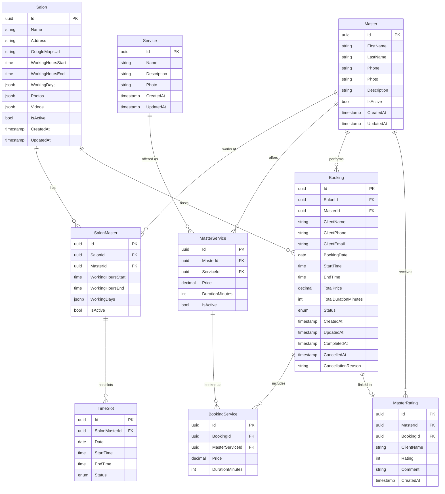

# Beauty Salon Booking System — Architecture

## 1. Solution Structure

```
Bookio/
├── src/
│   ├── Bookio.API/
│   ├── Bookio.Application/
│   ├── Bookio.Domain/
│   └── Bookio.Infrastructure/
├── tests/
│   └── Bookio.Tests/
├── ARCHITECTURE.md
├── README.md
└── Bookio.sln
```

### Project Descriptions

| Project | Responsibility |
|---|---|
| **Domain** | Entities, Enums, Value Objects, Domain interfaces. No dependencies on other projects. |
| **Application** | Use cases, DTOs, Validators (FluentValidation), Service interfaces, MediatR Commands/Queries. Depends on Domain. |
| **Infrastructure** | EF Core DbContext, Migrations, Repository implementations, NotificationService stub, Seed data. Depends on Application + Domain. |
| **API** | Controllers, Middleware (exception handling, logging), Program.cs, Swagger config. Depends on Application + Infrastructure (for DI). |
| **Tests** | Unit and integration tests. Depends on Application + Infrastructure. |

### Dependency Graph

```
API → Application → Domain
API → Infrastructure
Infrastructure → Application → Domain
```

---

## 2. Database Schema (ER Diagram)



### Enum Values

**TimeSlot.Status**: `Available`, `Booked`, `Blocked`

**Booking.Status**: `Pending`, `Confirmed`, `Completed`, `CancelledByClient`, `CancelledByMaster`

---

## 3. API Endpoints

### SalonsController — `/api/salons`

| Method | Route | Description |
|---|---|---|
| GET | `/api/salons` | List all active salons |
| GET | `/api/salons/{id}` | Salon details with associated masters |
| POST | `/api/salons` | Create a new salon |
| PUT | `/api/salons/{id}` | Update salon info |
| DELETE | `/api/salons/{id}` | Soft-delete salon (IsActive = false) |
| GET | `/api/salons/{id}/masters` | List masters linked to this salon |
| GET | `/api/salons/{id}/services` | All services available at this salon |
| GET | `/api/salons/{salonId}/bookings` | Bookings at this salon (filterable) |

### MastersController — `/api/masters`

| Method | Route | Description |
|---|---|---|
| GET | `/api/masters` | List all active masters |
| GET | `/api/masters/{id}` | Master details with average rating |
| POST | `/api/masters` | Create a new master |
| PUT | `/api/masters/{id}` | Update master info |
| DELETE | `/api/masters/{id}` | Soft-delete master (IsActive = false) |
| GET | `/api/masters/{id}/services` | Services offered by this master |
| GET | `/api/masters/{id}/ratings` | All ratings for this master |
| GET | `/api/masters/{id}/average-rating` | Master's average rating (1–5) |
| GET | `/api/masters/{masterId}/bookings` | Bookings for this master (filterable) |

### SalonMastersController — `/api/salons/{salonId}/masters`

| Method | Route | Description |
|---|---|---|
| POST | `/api/salons/{salonId}/masters` | Link an existing master to a salon with schedule |
| PUT | `/api/salons/{salonId}/masters/{masterId}` | Update master's schedule/hours at this salon |
| DELETE | `/api/salons/{salonId}/masters/{masterId}` | Unlink master from salon (soft delete) |

### ServicesController — `/api/services`

| Method | Route | Description |
|---|---|---|
| GET | `/api/services` | List all services (global catalog) |
| POST | `/api/services` | Create a new service |
| PUT | `/api/services/{id}` | Update service info |
| DELETE | `/api/services/{id}` | Delete service from catalog |

### MasterServicesController — `/api/masters/{masterId}/services`

| Method | Route | Description |
|---|---|---|
| POST | `/api/masters/{masterId}/services` | Add a catalog service to master with price and duration |
| PUT | `/api/masters/{masterId}/services/{serviceId}` | Update price or duration for this master |
| DELETE | `/api/masters/{masterId}/services/{serviceId}` | Remove service from master's offerings |

### TimeSlotsController

| Method | Route | Description |
|---|---|---|
| GET | `/api/salons/{salonId}/masters/{masterId}/slots` | Available slots for date and selected services (`?date=&serviceIds=`) |
| POST | `/api/salons/{salonId}/masters/{masterId}/slots` | Manually create slots (batch) |
| POST | `/api/salons/{salonId}/masters/{masterId}/slots/generate` | Auto-generate slots for a date range |
| PUT | `/api/slots/{id}` | Update slot status (Block/Unblock) |
| DELETE | `/api/slots/{id}` | Delete a slot |

### BookingsController — `/api/bookings`

| Method | Route | Description |
|---|---|---|
| GET | `/api/bookings` | All bookings with optional filters (date, salon, master, status) |
| GET | `/api/bookings/{id}` | Full booking details including services |
| POST | `/api/bookings` | Create a new booking (validates slots, calculates totals) |
| PUT | `/api/bookings/{id}/confirm` | Confirm a pending booking |
| PUT | `/api/bookings/{id}/complete` | Mark booking as completed |
| PUT | `/api/bookings/{id}/cancel` | Cancel booking (body: side + reason) |

### RatingsController

| Method | Route | Description |
|---|---|---|
| POST | `/api/masters/{masterId}/ratings` | Submit a rating for a master |
| GET | `/api/masters/{masterId}/ratings` | List all ratings for a master |
| DELETE | `/api/ratings/{id}` | Delete a rating (admin action) |

---

## 4. Domain Models

### Salon
| Field | Type | Notes |
|---|---|---|
| Id | Guid | PK |
| Name | string | Required |
| Address | string | Required |
| GoogleMapsUrl | string? | Optional |
| WorkingHoursStart | TimeOnly | e.g. 09:00 |
| WorkingHoursEnd | TimeOnly | e.g. 21:00 |
| WorkingDays | List\<DayOfWeek\> | Stored as JSON array |
| Photos | List\<string\> | URLs, stored as JSON |
| Videos | List\<string\> | URLs, stored as JSON |
| IsActive | bool | Soft-delete flag |
| CreatedAt | DateTime | UTC |
| UpdatedAt | DateTime | UTC |

### Master
| Field | Type | Notes |
|---|---|---|
| Id | Guid | PK |
| FirstName | string | Required |
| LastName | string | Required |
| Phone | string | Required |
| Photo | string? | URL |
| Description | string? | Bio |
| IsActive | bool | Soft-delete flag |
| CreatedAt | DateTime | UTC |
| UpdatedAt | DateTime | UTC |

### SalonMaster
| Field | Type | Notes |
|---|---|---|
| Id | Guid | PK |
| SalonId | Guid | FK → Salon |
| MasterId | Guid | FK → Master |
| WorkingHoursStart | TimeOnly | At this specific salon |
| WorkingHoursEnd | TimeOnly | At this specific salon |
| WorkingDays | List\<DayOfWeek\> | JSON array |
| IsActive | bool | Soft-delete flag |

### Service
| Field | Type | Notes |
|---|---|---|
| Id | Guid | PK |
| Name | string | e.g. "Hair Highlighting" |
| Description | string? | Optional |
| Photo | string? | URL |
| CreatedAt | DateTime | UTC |
| UpdatedAt | DateTime | UTC |

### MasterService
| Field | Type | Notes |
|---|---|---|
| Id | Guid | PK |
| MasterId | Guid | FK → Master |
| ServiceId | Guid | FK → Service |
| Price | decimal | Price set by master |
| DurationMinutes | int | Duration set by master |
| IsActive | bool | Can disable without deleting |

### TimeSlot
| Field | Type | Notes |
|---|---|---|
| Id | Guid | PK |
| SalonMasterId | Guid | FK → SalonMaster |
| Date | DateOnly | |
| StartTime | TimeOnly | |
| EndTime | TimeOnly | |
| Status | TimeSlotStatus | Available / Booked / Blocked |

### Booking
| Field | Type | Notes |
|---|---|---|
| Id | Guid | PK |
| SalonId | Guid | FK → Salon |
| MasterId | Guid | FK → Master |
| ClientName | string | |
| ClientPhone | string | |
| ClientEmail | string? | |
| BookingDate | DateOnly | |
| StartTime | TimeOnly | |
| EndTime | TimeOnly | Calculated from total duration |
| TotalPrice | decimal | Sum of BookingService prices |
| TotalDurationMinutes | int | Sum of BookingService durations |
| Status | BookingStatus | Pending / Confirmed / Completed / Cancelled* |
| CreatedAt | DateTime | UTC |
| UpdatedAt | DateTime | UTC |
| CompletedAt | DateTime? | Set when status → Completed |
| CancelledAt | DateTime? | Set when status → Cancelled |
| CancellationReason | string? | Optional free text |

### BookingService
| Field | Type | Notes |
|---|---|---|
| Id | Guid | PK |
| BookingId | Guid | FK → Booking |
| MasterServiceId | Guid | FK → MasterService |
| Price | decimal | Snapshot at time of booking |
| DurationMinutes | int | Snapshot at time of booking |

### MasterRating
| Field | Type | Notes |
|---|---|---|
| Id | Guid | PK |
| MasterId | Guid | FK → Master |
| BookingId | Guid? | FK → Booking (optional) |
| ClientName | string | |
| Rating | int | 1–5 stars |
| Comment | string? | |
| CreatedAt | DateTime | UTC |

---

## 5. Main Business Processes

### Available Slots Calculation
1. Accept: `salonId`, `masterId`, `date`, `serviceIds[]`
2. Sum durations of all selected `MasterService` records → `totalDuration`
3. Query `TimeSlot` where `SalonMasterId` matches salon+master, `Date = date`, `Status = Available`
4. Sort slots by `StartTime`; find contiguous runs where total span >= `totalDuration`
5. Return starting slots that can accommodate the full booking

### Booking Creation
1. Validate request (client info, serviceIds, startTime, salonId, masterId)
2. Load `MasterService` records for each serviceId → sum price + duration
3. Calculate `EndTime = StartTime + totalDuration`
4. Check that all required `TimeSlot` records in the range are `Available`
5. Mark covered `TimeSlot` records as `Booked`
6. Create `Booking` + `BookingService` records
7. Call `INotificationService.SendBookingConfirmationAsync(bookingId)`

### Booking Cancellation
1. Validate booking exists and is in a cancellable state (Pending or Confirmed)
2. Set `Status = CancelledByClient` or `CancelledByMaster`
3. Set `CancelledAt`, `CancellationReason`
4. Release covered `TimeSlot` records back to `Available`
5. Call `INotificationService.SendCancellationNotificationAsync(bookingId, side)`

### Booking Completion
1. Verify booking is `Confirmed`
2. Verify `BookingDate + EndTime` is in the past
3. Set `Status = Completed`, `CompletedAt = UtcNow`
4. (No slot action needed — slots already consumed)

### Slot Auto-Generation
1. Accept: `salonMasterId`, `startDate`, `endDate`, `slotDurationMinutes`
2. For each date in range that falls on a `SalonMaster.WorkingDay`:
   - Iterate from `WorkingHoursStart` to `WorkingHoursEnd` in `slotDurationMinutes` increments
   - Skip slots that already exist for that time
   - Insert `TimeSlot` with `Status = Available`

---

## 6. Technology Decisions

| Concern | Choice | Reason |
|---|---|---|
| Framework | ASP.NET Core 8 Web API | Target platform, LTS |
| ORM | Entity Framework Core 8 | PostgreSQL support, migrations |
| Database | PostgreSQL | Robust JSONB for arrays (WorkingDays, Photos, Videos) |
|3 Validation | FluentValidation | Declarative, testable, integrates with ASP.NET Core |
| Logging | Serilog | Structured logging, flexible sinks |
| Documentation | Swagger / Swashbuckle | Auto-generated OpenAPI spec |
| Architecture | Clean Architecture (Domain / Application / Infrastructure / API) | Separation of concerns, testability |
| Mediator | MediatR (optional, can skip for simplicity) | CQRS-lite for Application layer |
| JSON arrays | PostgreSQL JSONB columns | `WorkingDays`, `Photos`, `Videos` stored as JSON; EF Core value converters |

---

## Architecture Checklist

- [x] ER diagram with all entities and relationships
- [x] Complete list of API endpoints
- [x] Description of all entities with fields and types
- [x] Solution folder structure
- [x] Description of main business processes
- [x] Technology decisions and justifications
